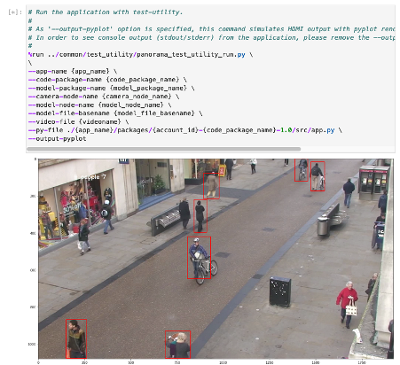
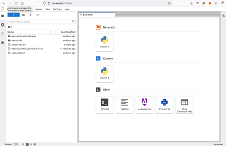
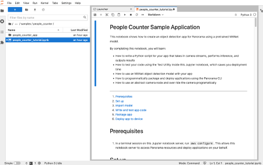

# A Guide for Deploying AWS Panorama

This guide shows an end-to-end setup of an AWS Panorama deployment from the physical device setup to deploying a sample notebook. It includes steps to specify a deployment in a particular AWS region.

## Deploy AWS Panorama

### Prerequisites
* AWS Account
* IAM role in this account with the AWSPanoramaFullAccess permission 

### Create AWS Panorama Device
These instructions are also documented here: https://docs.aws.amazon.com/panorama/latest/dev/gettingstarted-setup.html 

* Login in to the AWS Management Console
* In the top menu bar, region drop down, select your AWS region, e.g. Sydney (ap-southeast-2)
* Search for and open AWS Panorama
* Select Get Started
* Select Add device
* Select Begin setup

#### Specify Name
* Enter a Name – should be descriptive and unique – e.g. project-name-panorama
* Enter a Description
* Add new tag – Key Name, Value = Panorama
* Select Next

#### Power on
* Plug in the cables, and power on the device
* Select Next

#### Configure
* Connect to a network via Ethernet in order for the device to access cameras on your local network and in order to manage the device from the AWS cloud.
* Select Next

#### Download file
* Download the configuration archive file. This is a zip file. Do not unzip it once it is downloaded.
* The configuration file will expire in 5:00 mins. Proceed to the next step to complete this process.
* Transfer configuration file to the USB storage device
* Select Next

#### Done
* Plug in the USB storage device on your device.
* Once complete the device will appear in the list of devices in the AWS Management console

## Setup the Development Environment
The setup below is based on the instructions in https://github.com/aws-samples/aws-panorama-samples/blob/main/docs/EnvironmentSetup.md 

### Create an Amazon S3 Bucket for the AWS Panorama Model Files
* In the AWS management console, search for S3, select S3
* Select Create bucket
* Enter bucket name: project-name-panorama-bucket-aws-accountid
* Select the AWS region: ap-southeast-2
* Select Create bucket
* Copy the bucket name in a notepad.

### Subscribe to Ubuntu Bionic in the AWS Marketplace
* In the AWS management console, search for Marketplace, select AWS Marketplace Subscriptions
* Select Discover products
* Search for Ubuntu 18.04 LTS – Bionic (Arm)
* Select Ubuntu 18.05 LTS – Bionic (Arm)
* Select Accept Terms
* You should see a message: Thank you for subscribing to this product! We are processing your request.
* Wait until message changes to: Thank you for subscribing to this product! You can now configure your software.

### Create a PEM key
* In the AWS management console, search for EC2, select EC2
* In the left side menu, under Network and Security, select Key Pairs
* Select Create key pair
* Enter name: project-name-panorama-server-v1
* Select Create key pair
* A project-name-panorama-server-v1.pem file will download. Note its location.

### Deploy the Amazon CloudFormation Stack
* In the AWS management console, search for CloudFormation, select CloudFormation
* Select Create stack, Select With new resources (standard)
* Select Upload a template file
* Select Choose file
* In the window popup, find and select the ec2-instance-panorama-v2.yml file, select Open
* Select Next
* Enter a stack name: project-name-panorama-server-v1
* Select KeyName: project-name-panorama-server-v1
* Select a VpcId from the drop down list –  a Virtual Private Cloud (VPC) is a logically isolated virtual network in your AWS account – your IT department may have a preference for where this should be deployed.
* Select Next
* In the Configure stack options screen, select Next
* In the Review screen, at the bottom of the page check I acknowledge that AWS CloudFormation might create IAM resources.
* Select Submit
* The screen should change to an Events page with a CREATE_IN_PROGRESS message
* Wait about 3 minutes until status is CREATE_COMPLETE
* Select Outputs
* Copy the publicName (the public DNS) value to a notepad. It will have a value in the format:
ec2-12-34-567-89.ap-southeast-2.compute.amazonaws.com 

 ### Connect to the Amazon EC2 Instance
* Locate your private key file. The key used to launch this instance is project-name-panorama-server-v1.pem
* Run this command, if necessary, to ensure your key is not publicly viewable.
chmod 400 ~/Downloads/computer-vision.pem
* Use SSH to connect to your instance using its Public DNS
ssh -i ~/Downloads/computer-vision.pem ubuntu@ec2-12-34-567-89.ap-southeast-2.compute.amazonaws.com
* Check the bootup script is deploying
tail -f /var/log/cloud-init-output.log
* The installation process takes about 30 minutes.
* When complete you should see the message echo 'INSTALLATION COMPLETE'

### Launch Juypter Lab
* Launch the Juypter Lab session
sudo jupyter-lab --no-browser --allow-root
* You should see a response similar to:
http://ip-123-45-678-910:8888/lab?token=e#############################
* Copy the port number (8888) and the token value ( e############################# ) to a notepad.
* Open another SSH terminal on your computer.
ssh -i ~/Downloads/computer-vision.pem -NL 8157:localhost:8888 ubuntu@ec2-12-34-567-89.ap-southeast-2.compute.amazonaws.com
* Launch a web browser on your computer and open:
http://localhost:8157/
* Paste the token number
* Select Log in
* You should now be in the Jupyter Lab session

## Creating Notebook in an AWs account separate from the AWS Panorama AWS account
This step is only required if the notebook is running in an account separate from the AWS Panorama AWS account.

### Create an AWS IAM User
* Create an IAM user with IAM permissions to deploy code to the AWS Panorama device.
* Record the access key and secret access key for use in the Jupyter Lab session

### Configure the AWS CLI
In a terminal session on this Jupyter notebook server, run aws configure. This allows this notebook server to access Panorama resources and deploy applications on your behalf.

## Modify the AWS Panorama Sample - People Counter

* Open the Juptyer notebook under:
aws-panorama-samples/samples/people_counter/people_counter_tutorial.ipynb

### Code changes

/aws-panorama-samples/samples/common/test_utility/panorama_test_utility.py

line 15
panorama_client = boto3.client('panorama', region_name='ap-southeast-2')
/aws-panorama-samples/samples/people_counter/people_counter_tutorial.ipynb

Set up

s3_client = boto3.client('s3', region_name='ap-southeast-2')
panorama_client = boto3.client('panorama', region_name='ap-southeast-2')

Notebook parameters

Device ID, should look like: device-oc66nax4cgzwhyuaeyifrqowue
DEVICE_ID = 'device-1234567890' # input( 'DEVICE_ID (format: device-*)' ).strip()

Enter your S3 bucket info here
S3_BUCKET = ‘project-name-panorama-bucket-aws-accountid' # input( 'S3_BUCKET' ).strip()

Enter your desired AWS region
AWS_REGION = 'ap-southeast-2' # input( 'AWS_REGION (e.g. us-east-1)' ).strip()
ML_MODEL_FNAME = 'ssd_512_resnet50_v1_voc'

Prepare model for testing with notebook server
Compile the model to run with test-utility.
This step takes 7 mins ~ 10 mins.

%run ../common/test_utility/panorama_test_utility_compile.py \
\
--s3-model-location s3://{S3_BUCKET}/{app_name}/ \
\
--region 'ap-southeast-2' \
--model-node-name model_node \
--model-file-basename ./models/{ML_MODEL_FNAME} \
--model-data-shape '{model_data_shape}' \
--model-framework MXNET

### Create New Camera
CAMERA_NAME = "test_rtsp_camera"
CAMERA_CREDS = '{"Username":"root","Password":"password","StreamUrl": "rtsp://192.168.0.1/onvif-media/media.amp?profile=profile_1_h264&sessiontimeout=60&streamtype=unicast"}'

* Match the camera login details
* Test camera with VLC player first to check you can see the video stream
